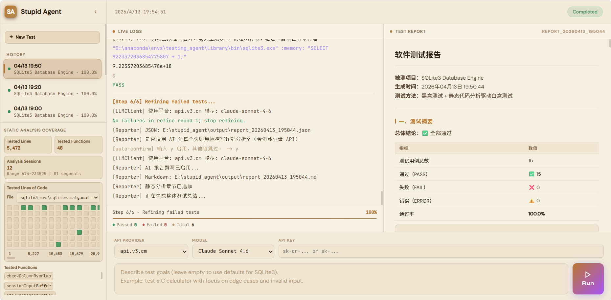
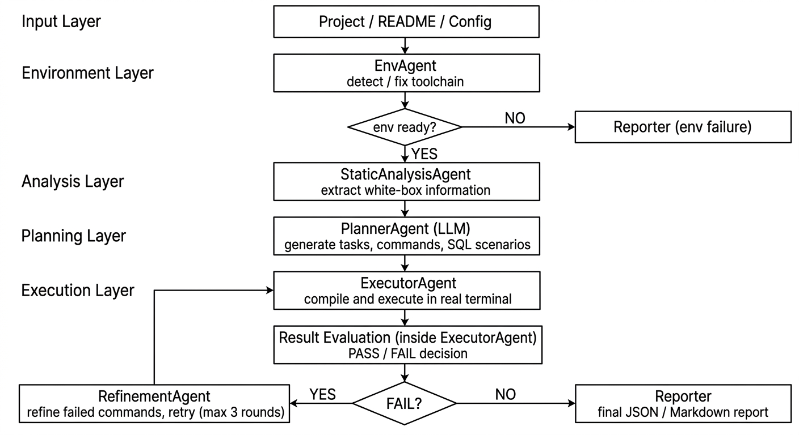
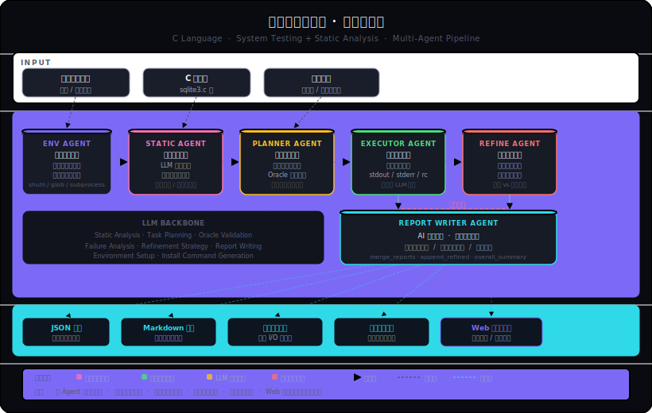

# 斯丢匹得软件测试智能体 —— Stupid Tesing Agent

<p align="center">
  
</p>
<p align="center">
  <em>Figure 1: Main interface of the system</em>
</p>

## 项目结构

```
stupid_agent/
├── main.py                  # ★ 控制台版本入口：在这里填写测试框架，然后运行
├── web_app.py               # ★ UI版本入口：在这里填写测试框架，然后运行
├── config.py                # 配置（API Key、超时等）
├── .gitignore               # 配置（Git 忽略文件）
├── requirements.txt
│
├── agents/
│   ├── planner_agent.py             # Agent 1：测试规划（调用 Claude API 细化任务）
│   ├── executor_agent.py            # Agent 2：测试执行（调用本地终端）+ 结果分析
│   ├── env_agent.py                 # Agent 3：环境配置（调用 Claude API）
│   ├── refinement_agent.py          # Agent 4：针对现有测试错误进一步进行精细化测试
│   ├── reporter_write_agent.py      # Agent 5：帮助撰写测试报告
│   └── static_analysis_agent.py     # Agent 6：拉取并分析源码
│
├── core/
│   ├── terminal.py          # 本地终端交互封装（subprocess）
│   ├── llm_client.py        # Claude API 封装、或者其他 API 封装
│   └── reporter.py          # 报告输出（JSON + Markdown）
│
└──  output/                  # 测试报告自动保存到这里
```

## 🚀 Features
- **EnvAgent**: Automatically detects and installs compilers and tools  
- **StaticAnalysisAgent**: Performs white-box analysis on source code  
- **PlannerAgent**: Generates tasks using combined black-box and white-box strategies  
- **ExecutorAgent**: Executes tasks in a real terminal environment  
- **RefinementAgent**: Refines results based on failures  
- **Dual-platform LLM switching**  
- **JSON + Markdown reporting**


## 快速使用UI版本
在Release中找到exe文件下载https://github.com/new-tonAA/stupid_agent/releases ，双击运行即可

## 针对源码快速开始
### 0. 找到或安装gcc用于编译cpp (MinGW)（其实可以不做，直接让agent做，但是得把1后的先配好）
如果本来就有cpp编译器，则寻找：
```bash
Get-ChildItem -Path "D:\","E:\","C:\" -Recurse -Filter "gcc.exe" -ErrorAction SilentlyContinue | Select-Object FullName
```
则会输出例如（下面为我电脑的真实输出）：
```
FullName                                                        
--------
D:\anaconda\pkgs\m2w64-gcc-5.3.0-6\Library\mingw-w64\bin\gcc.exe
D:\Dev-Cpp\MinGW32\bin\gcc.exe
D:\Dev-Cpp\TDM-GCC-64\bin\gcc.exe                               
D:\qt\Tools\llvm-mingw1706_64\bin\gcc.exe                       
D:\qt\Tools\mingw1120_64\bin\gcc.exe                             
```
我这里用 `TDM-GCC-64`，64位的最好，如果是qt项目可以试试后面两个   
然后直接改 main.py 里的 compile_cmd（反正我是直接硬编码）：
```
"compile_cmd": "\"D:\\Dev-Cpp\\TDM-GCC-64\\bin\\gcc.exe\" tests/sample_c/calculator.c -o tests/sample_c/calculator.exe -lm",
```
或者一劳永逸把它加到 PATH，以后直接用 gcc：
```bash
powershell$env:PATH += ";D:\Dev-Cpp\TDM-GCC-64\bin"
```
这个只对当前 PowerShell 窗口有效。如果想永久生效：
```bash
powershell[System.Environment]::SetEnvironmentVariable("PATH", $env:PATH + ";D:\Dev-Cpp\TDM-GCC-64\bin", "User")
```
然后重开 PowerShell，`gcc --version` 就能用了，`main.py` 也不用改。

如果没找到gcc则安装，找到请跳过：

安装gcc最简单的方式，PowerShell 里运行：
```bash
winget install MinGW.MinGW
```
装完之后关掉 PowerShell 重新开，然后验证：
```bash
powershellgcc --version
```
如果 winget 没有，备选方案是去下载 https://www.mingw-w64.org 装完手动把 bin 目录加到 PATH。

### 1. 环境配置与安装依赖

```bash
conda create -n testing_agent python=3.11
conda activate testing_agent
pip install -r requirements.txt
```

### 2. 设置 API Key（如果是想用UI版本，可以不设置，在UI界面中再设置）
如果使用claude，则使用OpenRouter（跟以前一样）：
```bash
# Linux / macOS
export ANTHROPIC_API_KEY="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"

# Windows PowerShell
$env:ANTHROPIC_API_KEY="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"
```
如果使用其他（或者盗版claude），则采用api.v3.cm
```bash
$env:LLM_PROVIDER="v3"
$env:V3_API_KEY="sk-yFdUWpyS4iTwnT8GD1903a92Da60409cB8B4Be85F16a334d"
$env:V3_MODEL="claude-sonnet-4-6"   # 或 gpt-4o 等，不填默认 gpt-4o，具体有什么模型见：https://api.v3.cm
python main.py
```
如果嫌弃环境变了麻烦，也可以在 config.py 里直接改（不用环境变量），但是不推荐哈：
```python
pythonLLM_PROVIDER = "v3"     # 改这一行
V3_API_KEY = "你的key"         # 填这里
V3_MODEL = "gpt-4o"           # 选模型
```

如果是在 PyCharm 中：Run → Edit Configurations → Environment Variables，添加 `ANTHROPIC_API_KEY`。

### 3. 修改测试框架（`main.py` 或者 `web_app.py` 顶部的 `TEST_FRAMEWORK`）

把 `TEST_FRAMEWORK` 字典中的字段替换为你自己的被测项目信息即可，其余代码不用动。

### 4. 运行

```bash
python main.py
```
或者UI版本：
```bash
python web_app.py
```

### 5. 打包成exe（看个人需求）
```bash
pyinstaller -F web_app.py --hidden-import=core --hidden-import=agents --hidden-import=engineio.async_drivers.threading --hidden-import=socketio.async_drivers.threading
```

## 换成自己的被测项目

只需要修改 `main.py` 或 `web_app.py` 中的 `TEST_FRAMEWORK`：

```python
TEST_FRAMEWORK = {
    "project_name": "你的项目名",
    "language": "C",                          # 或 Python、Java 等
    "binary": "path/to/your/executable",
    "compile_cmd": "gcc your_file.c -o out",  # 不需要编译则填 ""
    "description": "程序的功能描述",
    "test_goals": ["测试目标1", "测试目标2"],
    "extra_notes": "补充说明（调用方式等）",
}
```

## 工作流程

<p align="center">
  
</p>
<p align="center">
  <em>Figure 2: Pipeline of the testing process</em>
</p>

<p align="center">
  
</p>
<p align="center">
  <em>Figure 4: Detailed Pipeline</em>
</p>

## Oracle 类型说明

| oracle_type    | 判定逻辑 |
|----------------|----------|
| `crash_check`  | 程序未崩溃（exit code 不是 segfault）即通过 |
| `exit_code`    | 检查 exit code 是否为 0 或非 0 |
| `stdout_match` | stdout 中包含期望字符串 |
| `stdout_exact` | stdout 与期望字符串完全一致 |
| `manual`       | 输出到终端，人工判断 |


## License
This project is licensed under the Apache 2.0 License.
